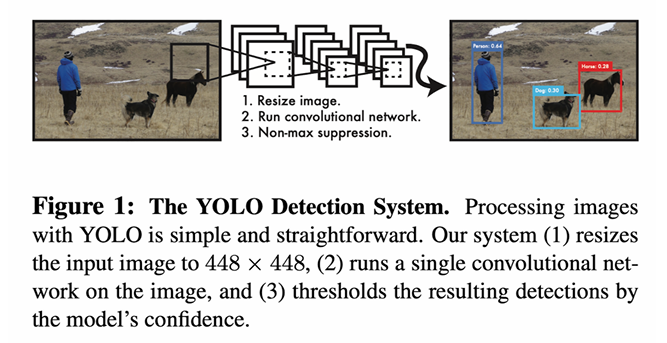
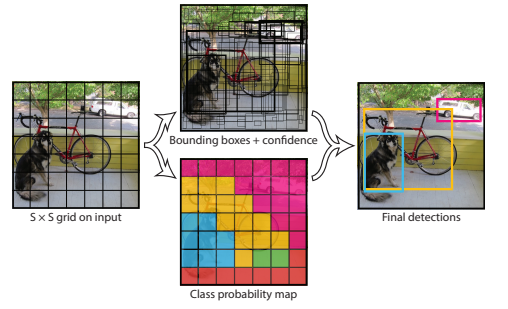
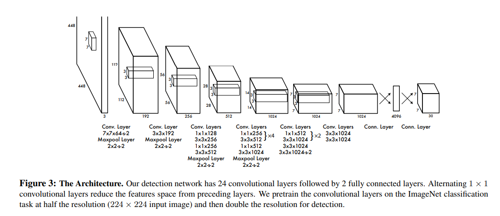
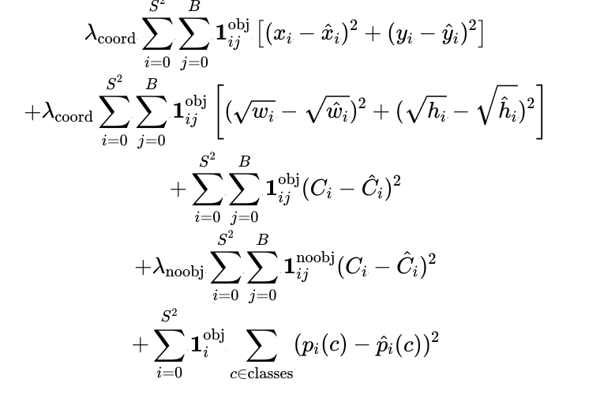
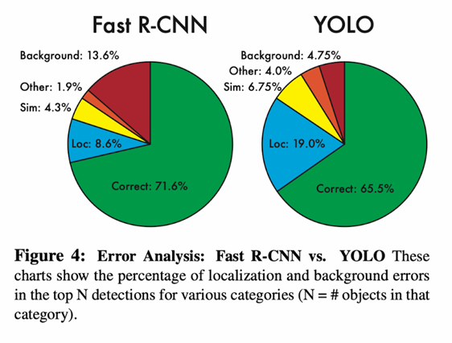
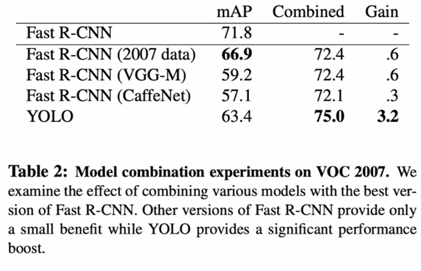
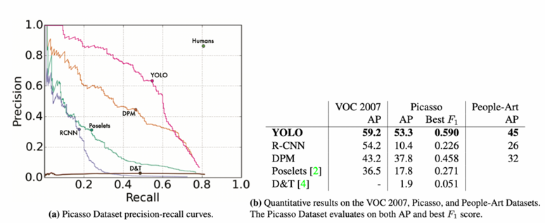
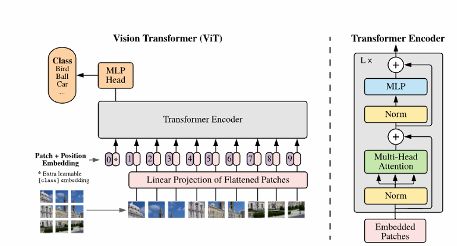

# BOAZ_10주차_과제.md
## You Only Look Once:Unified, Real-Time Object Detection
### Overview
기존 객체 탐지 방식은 주로 classifier하여 탐지했으나, YOLO는 이를 **회귀 문제(regression problem)**로 재정의하였다. 하나의 CNN이 입력 이미지를 통해 **바운딩 박스 좌표와 클래스 확률**을 동시에 출력한다.

* 실시간 성능: 45 FPS (YOLO), 155 FPS (Fast YOLO)
* 장점: 빠른 속도, 낮은 배경 오탐율, 전역적 표현 학습
* 한계: 작은 객체나 위치(localization) 정밀도는 다소 떨어짐

---

### Introduction

* **기존 탐지 방식**:

  * DPM: 슬라이딩 윈도우 기반, 계산량 큼
  * R-CNN: region proposal + 분류기 조합, 파이프라인 복잡
* **YOLO**: 이미지 전체를 한 번에 보고(end-to-end) 객체 위치와 클래스를 예측 → 간단하고 최적화 용이
* 이점:

  1. 속도: 복잡한 파이프라인 제거, 실시간 탐지 가능
  2. 전역 컨텍스트 활용: 배경 오류 감소
  3. 일반화: 다른 도메인에도 적응력 높음

---

### Methods : Unified Detection

* 입력 이미지를 **S × S grid**로 분할
* 각 grid cell이 해당 셀 중심에 포함된 객체를 탐지

* 각 셀 예측 내용:
  * B개의 바운딩 박스 + confidence score
  * 조건부 클래스 확률 Pr(Class | Object)
* 최종 score = confidence × class probability

---

### Network Design

* 기반: GoogLeNet 변형 (inception module 대신 1×1 conv 사용)
* 구조: 24개 conv layer + 2개 fully connected layer
* Fast YOLO: 더 얕은 네트워크 (9 conv layers)로 속도 향상

---

### Training

* **사전 학습(Pretraining)**: ImageNet classification dataset에서 convolutional layer 학습
* **탐지 전환(Fine-tuning)**: detection task에 맞게 conv layer 4개와 FC layer 2개 추가
* **출력 계층**: 클래스 확률 + bounding box 좌표 동시 예측
* **정규화**: 좌표와 크기를 0\~1 범위로 변환, grid cell offset 기반
* **활성화 함수**: Leaky ReLU
* **손실 함수**: Sum-squared error 기반 multi-part loss

  * 좌표 오차 비중 확대 (λcoord = 5)
  * 배경 셀 confidence 오차 비중 축소 (λnoobj = 0.5)
  * width/height → 제곱근 사용 (작은 박스 안정성 향상)
* **책임 할당**: 하나의 grid cell에서 여러 박스를 예측할 경우 IOU가 가장 높은 predictor가 책임을 가짐

1. Object가 존재하는 grid cell i의 책임을 가지는 predictor j에서 coordinate loss.
2. Object가 존재하는 grid cell i의 책임을 가지는 predictor j에서 width와 height loss.
3. Object가 존재하는 grid cell i의 책임을 가지는 predictor j에서 confidence-score loss.
4. Object가 존재하지 않는 grid cell i의 책임을 가지는 predictor j에서 confidence
score loss.
5. Object가 존재하는 grid cell i에 대한 conditional class probability의 loss.

---

### Inference

* 테스트 시에도 한 번의 forward pass로 결과 산출 → 매우 빠름
* 다중 탐지 문제: Non-Max Suppression으로 중복 제거
* 작은 박스는 오차 영향이 크므로 성능 저하 요인

---

### Comparison to Other Detection Systems

* **DPM**: 정적 파이프라인, 속도 느림
* **R-CNN 계열**: 높은 정확도, 느린 속도
* **YOLO**: 단일 네트워크, 빠르고 단순
* **OverFeat/MultiBox**: YOLO와 일부 유사하지만 통합성 부족

---

### Experiments

* **VOC 2007**:

  * Fast YOLO: 52.7% mAP, 155 FPS
  * YOLO: 63.4% mAP, 45 FPS
* **Error Analysis**:

  * YOLO: localization error ↑, background error ↓
  * Fast R-CNN: localization error ↓, background error ↑
* **Combining YOLO + Fast R-CNN**: 

  * 상호 보완으로 성능 향상

---

### Generalization

* 예술 작품에서 사람 탐지 실험:

  * R-CNN: 자연 이미지 특화 → artwork에서는 성능 저하
  * YOLO & DPM: 형태/크기 정보를 모델링 → 도메인 변화에도 성능 유지

---

### Conclusion

* YOLO: 객체 탐지를 단일 CNN으로 통합한 **1-stage 모델**
* 빠르고 단순하면서도 다양한 환경에서 활용 가능
* Fast YOLO는 문헌상 가장 빠른 범용 객체 탐지기 중 하나

---
## Vision Transformer (ViT): An Image is Worth 16x16 Words

### observation

Vision Transformer(ViT)는 이미지를 **고정 크기 패치**로 나눈 뒤, 이를 NLP에서의 **토큰**처럼 Transformer encoder에 입력하는 방식을 제안한다. CNN과 달리 이미지에 특화된 inductive bias를 최소화했으며, 대신 \*\*대규모 데이터셋에서의 사전 학습(pre-training)\*\*으로 높은 성능을 확보한다.

* 소규모 데이터셋에서는 ResNet 등 CNN보다 성능이 떨어질 수 있음
* 대규모 데이터셋(JFT-300M 등)에서는 CNN을 능가하는 성능 달성
* 연산 효율이 뛰어나고 transfer learning에 강함

---

### Introduction

* Transformer는 NLP에서 SOTA를 달성했으며, 대규모 텍스트 사전 학습 + 작은 데이터셋 fine-tuning 전략으로 활용됨
* 비전 분야는 CNN 중심으로 발전해왔음
* ViT는 **이미지를 패치 단위로 분할해 Transformer에 직접 입력** → 최소한의 구조 변경
* inductive bias 부족으로 적은 데이터에서는 약점, 하지만 충분히 큰 데이터에서는 CNN보다 효과적

---

### Methods

#### 입력 처리

* 이미지를 크기 $P \times P$ 패치로 분할 (예: 16x16)
* 각 패치를 flatten 후 **linear projection**으로 D 차원 embedding 생성
* **\[CLS] 토큰**을 추가하여 이미지 전체 표현으로 사용
* **1D position embedding**을 더해 위치 정보 보강

#### Inductive Bias

* CNN이 가진 locality, translation equivariance 같은 편향이 없음
* ViT는 이런 구조적 특성을 학습을 통해 스스로 익혀야 함

#### Hybrid 구조

* CNN feature map을 transformer 입력으로 사용 가능 (성능 향상, 연산량 절감)

#### Fine-tuning & 해상도 조정

* 대규모 데이터셋에서 사전 학습 후, downstream task에 맞춰 fine-tuning
* fine-tuning 시 더 높은 해상도 사용 → position embedding 크기 차이는 **2D interpolation**으로 보정

---

### Experiments

#### 데이터셋 & 벤치마크

* Pre-training: ImageNet, ImageNet-21k, JFT-300M
* Benchmark: CIFAR-10/100, Oxford Pets, Flowers-102, VTAB

#### 주요 결과

* ImageNet: ViT-L/16, ViT-H/14 모델이 BiT, Noisy Student 등 CNN 기반 모델보다 우수
* VTAB: natural & structured task에서 ViT 우세, specialized task에서는 근소한 차이
* 데이터 크기 중요: 작은 데이터셋에서는 CNN > ViT, 큰 데이터셋에서는 ViT가 강력
* 연산 효율: ResNet 대비 2\~4배 적은 연산으로 같은 성능 도달

---

### 분석

* 패치 embedding은 row/column 내에서 유사성이 강함
* position embedding은 2D topology를 학습해 별도의 hand-crafted embedding 불필요
* **Self-supervised 학습**: Masked patch prediction으로 실험했으나, supervised pre-training보다 성능 낮음

---

### Conclusion

* ViT는 **이미지를 패치 시퀀스로 변환 후 Transformer로 처리**하는 단순하지만 강력한 방법
* CNN 기반 inductive bias 없이도 **대규모 데이터 학습 시 SOTA 성능 달성**
* Transfer learning과 효율성에서 큰 장점
* 다만 소규모 데이터셋 학습과 self-supervised 학습에서는 여전히 한계 존재
