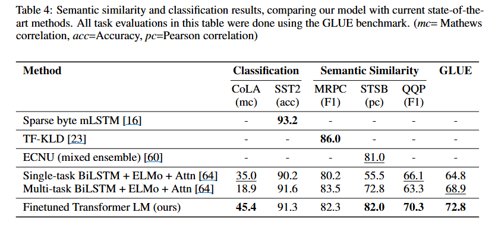
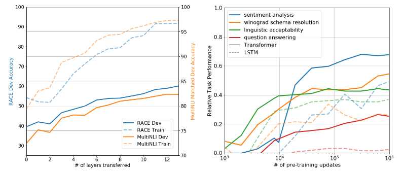
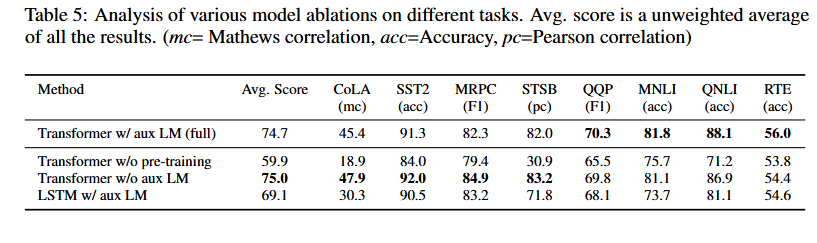

# BOAZ 8주차 과제
## Improving Language Understanding by Generative Pre-Training
### Abstract
```
자연어 이해(NLU)는 복잡한 작업들로 가득함. 문제는 이런 작업을 가르치려면 labeled data가 필요한데 많이 없음. unlabeled text는 넘침. → GPT-1이 이 문제에 대한 해결책을 제시함. 
```
1. generative pre-training\
다양한 unlabeled text를 가지고 language model을 generative pre-training한 후, discriminative fine-tuning을 통해 각각의 특정 task에서 큰 성능 향상을 얻도록 함. 

2. task-aware inpit transformation\
fine-tuning을 할 때 task-aware input transformation을 사용해서 모델 아키텍처를 바꾸는 것이 아니라, 문제의 형태를 GPT가 이해하기 쉬운 방식으로 바꿈.
---
PT는 상식 추론, 질문 답변, 텍스트 함의 같은 다양한 자연어 이해 문제에서 기존의 복잡한 모델들을 압도했음. 연구한 12가지 문제 중 무려 9가지에서 최고 기록을 갈아치웠음. 상식 추론 능력은 8.9%, 질문 답변 능력은 5.7%나 더 좋아졌음.

### Introduction
raw text로부터 효과적으로 학습하는 능력은 NPL에서 지도 학습에서 의존도를 완화하는 데 매우 중요함. 대부분의 딥러닝 방법은 상당한 양의 수동으로 지정된 labeled data를 필요로 함. → annotated resources가 부족한 많은 도메인에서 적용 가능성을 제한함. → unlabeled data를 활용할 수 있는 모델은 좋은 대안이 됨.
- word embedding 같은 비지도 학습은 이미 성능 향상에 크게 기여했지만, 단어 수준을 넘어 문장, 대화 수준의 표현을 학습하는 건 어려움.  
- 어떤 objective가 transfer에 좋은지, 어떻게 target task에 transfer할지 합의가 없음.    
- Transformer 기반으로 긴 문맥을 다루고, 보편적 표현을 학습해 적은 수정으로 다양한 task에 적용함.
```
이 논문에서는 Unsupervised pre-training + supervised fine-tuning 방식인 semi-sumpervised approach를 제안.
```

#### Related Work
- **Semi-supervised learning for NLP** : 과거에는 unlabeled data로 통계 feature를 만들거나 word embedding을 활용. 하지만 단어 수준 정보에 국한됨. 
- **Unsupervised pre-training**: 원래는 이미지/음성 분야에서 먼저 쓰였음. NLP에서도 LSTM 기반 pre-train+fine-tune 시도가 있었으나 긴 문맥 처리 한계 존재. → 본 논문에서는 Transformer를 사용해 더 긴 linguistic structure를 포함. 또한 pre-training은 단순히 initialization 역할뿐만 아니라 regularization 효과도 있음.
- **GPT의 차별점** : Transformer 사용 → long-range dependency 잘 학습. task-specific 아키텍처 추가 없이 transfer 가능.  
- **Auxiliary training objective**: Auxiliary modeling object를 target task objective에 추가해 sequence labeling task에서 성능 향상을 보인 연구가 있음.

---

### Framework
training 단계는 두 개로 나뉨. 
1) **Unsupervised pre-training**: 대규모 unlabeled text로 언어모델을 학습 → 모델의 초기 parameter 확보.  
2) **Supervised fine-tuning**: 얻은 parameter를 target task dataset에 맞게 조정 → 각 task에서 discriminative 성능 극대화.

#### 1. Unsupervised pre-training

- Multi-layer Transformer decoder를 사용함.
- multi-head self-attention을 input context token에 적용하고, position-wise feedforward layer를 통해 target token에 대한 output distribution을 생성함.


- 학습 objective는 language model의 확률을 최대화하는 것.


→ unlabeled text로부터 보편적 언어 표현(universal representation)을 학습하고 모델 초기 parameter 확보.


#### 2. Supervised fine-tuning
- 입력 시퀀스가 주어지면 pre-trained model의 최종 hidden state를 얻음.  
- 얻은 hidden state를 linear layer에 통과시킨 뒤 softmax 함수를 적용해 target label을 예측함.  


- fine-tuning의 학습 objective :  


- 추가적으로 LM objective를 auxiliary로 함께 사용하면  
  (a) supervised 모델의 일반화 성능이 향상되고  
  (b) 학습 수렴 속도가 빨라진다.  


#### 3. Task-specific input transformation
- task 마다 구조를 바꾸는 기존 방식은 task 마다 설계를 해야하며, 추가적인 architecture 구성 요소에 transfer learning을 적용하지 못함.
- 따라서 본 논문에서는 input을 ordered sequence로 설계하는 **traversal-style approach**를 씀.
- GPT는 task를 수정함.


---

### Experiments
#### Setup

##### Unsupervised pre-training
language model training에 7000권 이상의 책이면서 긴 문맥을 유지하는 Books Corpus datase 사용.


##### Model
 12-layer Transformer, 768 hidden dim, 12 heads. Adam optimizer, BPE vocab 40k.  

##### Fine-tuning
dropout 0.1, lr 6.25e-5, batch 32, epoch 3.  

#### Supervised fine-tuning
- **Natural Language Inference**: SNLI, MultiNLI, QNLI, SciTail 등에서 SOTA 달성 (최대 +5.8%).  

- **Question Answering & Commonsense**: Story Cloze +8.9%, RACE +5.7%.  
- **Semantic Similarity**: STS-B +1.0, QQP +4.2%.  
- **Classification**: CoLA 45.4 (기존 35.0 → 큰 향상), SST-2 91.3%.  
- **GLUE 종합 점수**: 72.8 (기존 최고 68.9 초과). 




---

### Analysis
- **Impact of number of layers transferred**: 더 많은 Transformer layer를 transfer할수록 성능 ↑ (MultiNLI에서 최대 +9%).


- **Zero-shot behaviors**: pre-train만으로도 sentiment, entailment, QA 등에서 의미 있는 성능 보임 → LM이 다양한 기능을 내재적으로 학습.  


- **Ablation studies**:  
  - pre-training 없으면 성능 -14.8%.  
  - Transformer 대신 LSTM 쓰면 성능 ↓ (특히 긴 문맥 불리).  
  - auxiliary LM objective는 큰 dataset에서 효과적.  

---

### Conclusion
- 단일 task-agnostic 모델로 다양한 NLU task에서 강력한 성능 달성.  
- 긴 문맥을 포함한 대규모 코퍼스에서의 **Generative pre-training**이 성능 향상의 핵심.  
- Fine-tuning 시 간단한 input transformation만으로도 좋은 transfer 성과.  
- 12개 task 중 9개에서 새로운 SOTA 기록.  
- → 비지도 사전학습을 통한 성능 향상은 실현 가능하며, Transformer + 긴 문맥 데이터셋이 특히 효과적임.  
